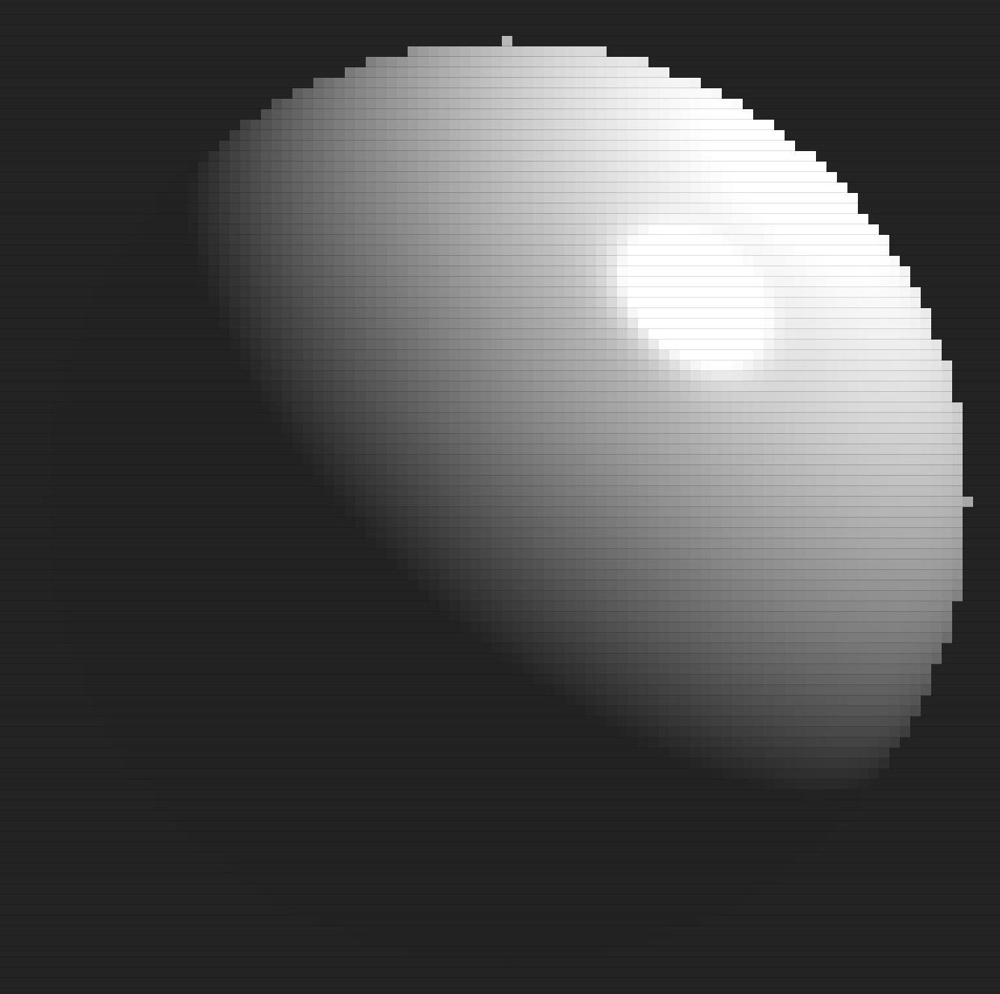
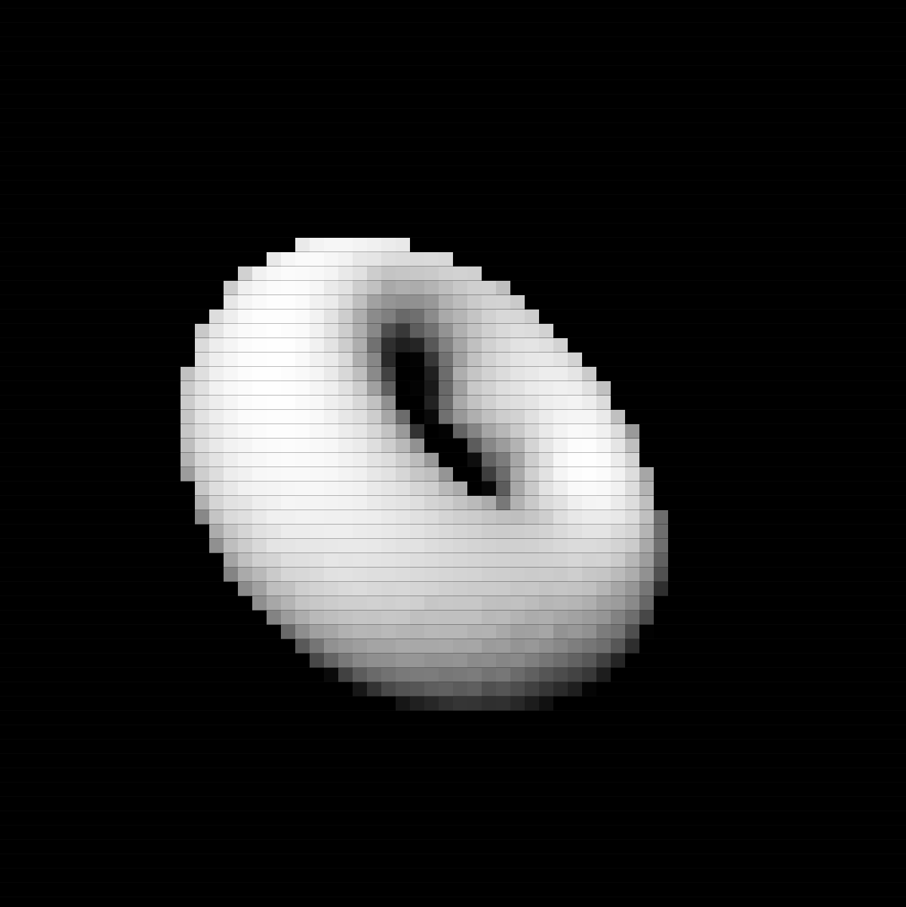
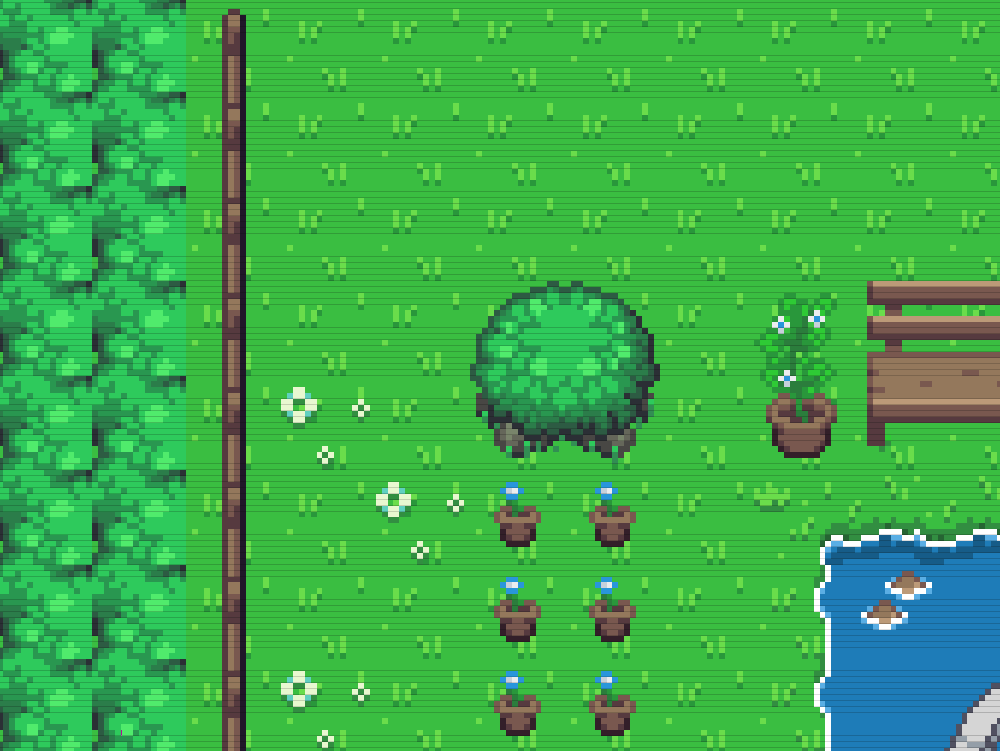
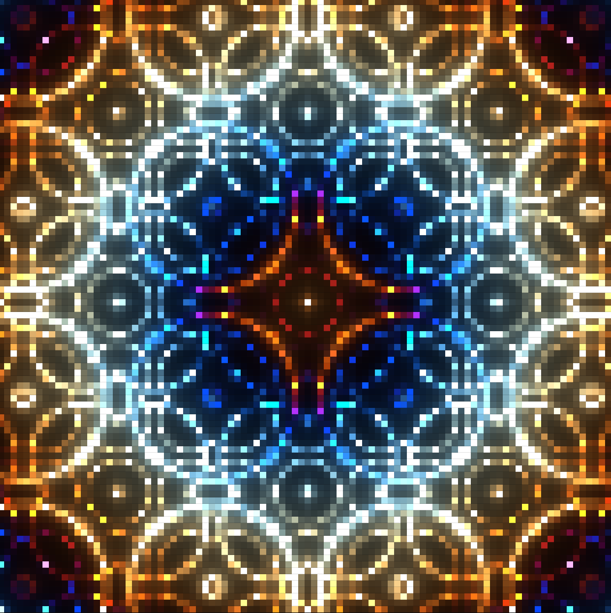
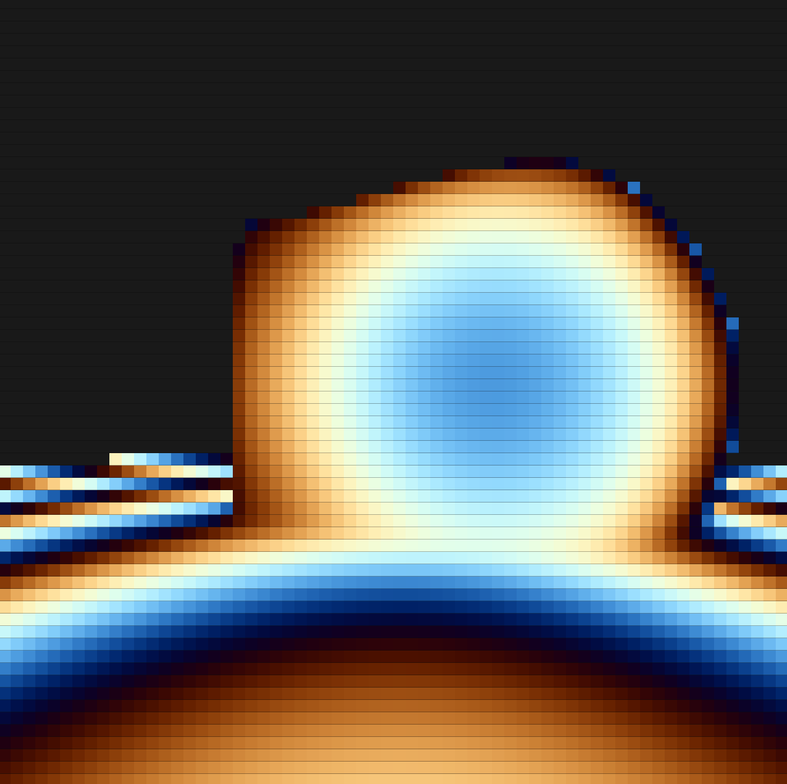

# terrible-renderer.cpp

couldn't bother myself finding a better name


## Table of Contents

- [Installation](#hi)
- [Usage](#hi)
- [Examples](#hi)
## Installation

First, you have to generate the build files using `CMake`

```bash
  https://github.com/Muhammed-Rajab/terrible-renderer.cpp.git
  cd terrible-renderer.cpp
  mkdir build
  cd build/
  cmake ..
```


## Usage

The main source code consists of `include/renderer.h` and `src/renderer.cpp`. You can copy them and include them in your project if you want to render custom graphics using them.

My main purpose with this project was to explore the possibilities with terminal rendering and most importantly, have fun. So, as you might have guessed, the code quality might not be the best.

## Examples

### sphere

I used basic parametric equations, fake normals maps and Phong reflection lighting model to render a sphere.



### donut

I used basic trigonometry, perspective project and some other cool but simple math tools to render a 'rotating donut'. Heavily inspired by [donut.c by a1k0n](https://www.a1k0n.net/2011/07/20/donut-math.html)



### game

My personal favorite. It renders a custom tilemap from a tileset to the terminal, which you can navigate using `WSAD` keys. Additionally you can change the speed of movement to each direction. Nothing fancy here, but I learned a lot working on this example.



### shader

My attempt to replicate the fragment shader in terminal. The visuals are almost identical to [An introduction to Shader Art Coding
 by kishimisu](https://www.youtube.com/watch?v=f4s1h2YETNY&ab_channel=kishimisu)



### raymarching

My attempt to simulate a simple raymarching scene in terminal. I followed [An introduction to Raymarching by kishimisu](https://www.youtube.com/watch?v=khblXafu7iA&t=1312s&ab_channel=kishimisu), to understand the concepts behind raymarching and successfully implemented my own in the process, but using my own renderer.



## License

[MIT](https://choosealicense.com/licenses/mit/)

